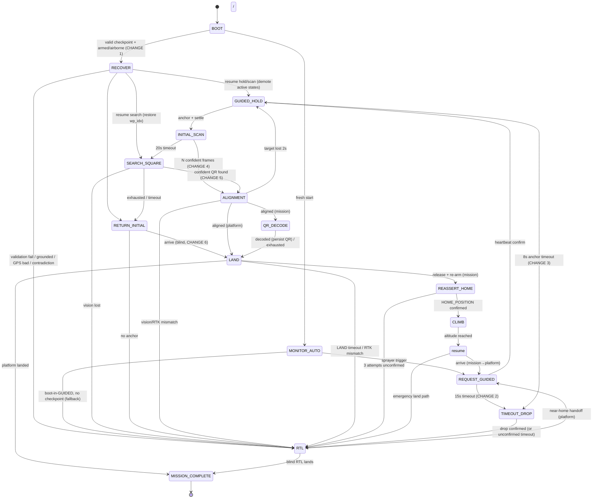

# ADDC-2026 — Change 1–6 Implementation Report

Status: **implemented, unit-tested, and verified end-to-end** against the existing
architecture. All six requested changes are in place; the original bench suite
(`test_fsm.py`, 3 tests) and the new suite (`test_recovery_and_changes.py`, 13
tests) pass, and a full happy-path mission runs coherently from BOOT to
MISSION_COMPLETE.

This document covers every deliverable: architecture, affected files, state-machine
changes, transition / recovery / timeout diagrams, the search & scan improvements,
parameter recommendations, edge-case analysis, safety analysis, testing strategy,
and a rollback plan.

---

## 0. Decisions taken on the four open questions

The user asked me to confirm four ambiguities before implementing. I proceeded with
best-judgment defaults (flagged here so they can be corrected if wrong):

| # | Question | Decision taken |
|---|----------|----------------|
| 1 | How aggressively to resume after reboot? | **Resume safe states only.** On a mid-flight reboot with a valid checkpoint, hold/navigation states (`GUIDED_HOLD`, `INITIAL_SCAN`, `SEARCH_SQUARE`, `RETURN_INITIAL`, `REASSERT_HOME`, `CLIMB`, `RETURN_TO_ORIGIN`) resume directly; active closed-loop states (`REQUEST_GUIDED`, `ALIGNMENT`, `QR_DECODE`) demote to `GUIDED_HOLD`; `LAND` demotes to `RTL`. Grounded/no-checkpoint/stale → fresh start or RTL. This replaces the old "boot-in-GUIDED → always RTL" policy **only when a valid checkpoint exists**; the always-RTL fallback remains for the no-checkpoint case. |
| 2 | AltHold literal vs LOITER for the timeout hold? | **LOITER hold + GUIDED descent.** Over MAVLink, `ALT_HOLD` does not hold XY and cannot accept companion velocity descent, so it cannot realize "hold XY + descend to 1 m AGL." ArduPilot `LOITER` (custom_mode 5) holds GPS position *and* altitude and is the technically-correct reading of the intent. The sequence is LOITER-hold → GUIDED-descend-to-1m → LOITER-stabilize → drop → RTL. Documented as the chosen interpretation. |
| 3 | Release on QR-not-found? | **Release (Change 6 as written).** The QR-not-found blind landing releases the payload (forced on a confirmed landing so the ultrasonic `[0.2,0.4] m` window gap on flat ground does not strand the drop), then continues the post-release pipeline to platform landing. `mission_flow.md` was updated to match (it previously claimed no release). |
| 4 | Search geometry / runtime param_set? | **Concentric squares + per-waypoint dwell + runtime WPNAV param_set (with restore).** Geometry kept (doc-consistent); speed lowered, accel/decel tightened via `param_set` and restored on exit; a hover dwell added after each waypoint. |

Two further defaults I locked from the code (call out if wrong):
- **Guided Hold Anchor** = `guided_anchor_ned`, the `LOCAL_POSITION_NED (x,y,z)` captured at GUIDED_HOLD entry. Persisted for recovery and used as the RETURN_INITIAL / Change-6 land target.
- **1 m AGL** = ultrasonic distance sensor on real hardware; relative altitude (`GLOBAL_POSITION_INT.relative_alt`) in SITL over flat ground — same convention the payload window already uses.
- **Payload release confirmation** = the existing `payload_released` flag (set when the open→wait→close servo sweep finishes), wrapped in a bounded wait + timeout fallback.

---

## 1. High-level architecture

The change set respects the existing layering. Nothing new talks to MAVLink except
`MAVLinkInterface`; nothing new touches the camera except `VisionPipeline`; the FSM
remains the only decision-maker.

```
┌────────────────────────────────────────────────────────────────────────┐
│ main.py (DroneSystem)                                                  │
│  ├─ tick loop (20 Hz) ──► StateMachine.tick()                          │
│  └─ injects MissionStore into StateMachine                             │
├────────────────────────────────────────────────────────────────────────┤
│ core/state_machine.py (FSM — single source of mission truth)           │
│  ├─ NEW State.RECOVER (crash-recovery entry, CHANGE 1)                 │
│  ├─ NEW _transition() → persists checkpoint after every transition     │
│  ├─ NEW _timeout_drop_and_rtl() (shared sequencer, CHANGES 2/3)        │
│  ├─ NEW _build_checkpoint() / _restore_checkpoint() / _tick_recover()  │
│  ├─ INITIAL_SCAN → confidence gate + N-consecutive confirm (CHANGE 4)  │
│  ├─ SEARCH_SQUARE → dwell + confidence gate + nav tuning (CHANGE 5)    │
│  └─ RETURN_INITIAL/LAND → blind-landing forced release (CHANGE 6)      │
├────────────────────────────────────────────────────────────────────────┤
│ core/mission_store.py  (NEW — atomic crash-consistent JSON checkpoint) │
├────────────────────────────────────────────────────────────────────────┤
│ core/flight_control.py (command driver)                                │
│  ├─ NEW set_mode() / set_loiter_mode() (mode switching for timeouts)   │
│  ├─ NEW set_yaw_rate() (optional scan sweep)                           │
│  └─ NEW apply/restore_search_nav_tuning() (WPNAV param_set, CHANGE 5)  │
├────────────────────────────────────────────────────────────────────────┤
│ core/mavlink_interface.py (transport + telemetry cache)                │
│  ├─ NEW set_param() (PARAM_SET for nav tuning)                         │
│  └─ NEW set_guided_yaw_rate() (yaw-rate position target)               │
├────────────────────────────────────────────────────────────────────────┤
│ vision/qr_detector.py                                                  │
│  ├─ NEW confidence scoring (_accept/_miss/_confidence/_track_consistency)
│  └─ IMPROVED _adapt_preprocessing (brightness-variance lighting robustness)
│ vision/vision_pipeline.py — expose 'confidence' in latest_result       │
├────────────────────────────────────────────────────────────────────────┤
│ config/*.yaml — recovery/system, search/flight, scan/vision keys       │
└────────────────────────────────────────────────────────────────────────┘
```

**Key invariant preserved:** the FSM never reads the camera and never sends a
MAVLink frame directly. `MissionStore` is a pure persistence utility with no MAVLink
or vision dependency, so it is trivially testable and cannot stall the flight loop.

---

## 2. Affected files & why

| File | Change | Why |
|------|--------|-----|
| `core/mission_store.py` | **NEW** | Atomic, crash-consistent, tolerant JSON checkpoint store (CHANGE 1 backbone). |
| `core/state_machine.py` | Major | RECOVER state, persistence in `_transition`, shared timeout-drop sequencer, scan confidence gate, search dwell + nav tuning, blind-landing forced release. |
| `core/flight_control.py` | Major | `set_mode`/`set_loiter_mode`, `set_yaw_rate`, `apply/restore_search_nav_tuning`. |
| `core/mavlink_interface.py` | Major | `set_param` (PARAM_SET), `set_guided_yaw_rate` (yaw-rate target). |
| `vision/qr_detector.py` | Major | Confidence scoring, temporal-consistency tracking, lighting-variance preprocessing. |
| `vision/vision_pipeline.py` | Minor | Propagate `confidence` through `latest_result`. |
| `main.py` | Minor | Instantiate `MissionStore`, inject into `StateMachine`. |
| `config/system.yaml` | Minor | `recovery:` block (enable, checkpoint path, max age, drop altitude, confirm timeout). |
| `config/flight.yaml` | Minor | Search speed 0.25 m/s, dwell, WPNAV search/default tuning, tighter tolerance. |
| `config/vision.yaml` | Minor | Initial-scan confidence threshold + confirm frames + optional yaw sweep. |
| `mission_flow.md` | Minor | Doc updated to match behavior (RECOVER, timeout-drop, scan/search, QR-not-found release). |
| `.gitignore` | Minor | Ignore the runtime `mission_state.json` + temp checkpoint files. |
| `test_recovery_and_changes.py` | **NEW** | 13 unit tests for all six changes. |

---

## 3. State-machine changes

### New state
- **`RECOVER`** — entered only at BOOT when a valid checkpoint exists *and* the
  vehicle is armed+airborne. Performs one validation pass and re-enters the last
  safe state. Not a normal mission step.

### Modified transitions (behavior, not wiring)
- `_transition()` now **persists a checkpoint after every transition**, resets the
  timeout-drop sequencer and scan/search per-entry counters, and clears the
  checkpoint on `MISSION_COMPLETE`.
- `BOOT` → probes for recovery before entering `MONITOR_AUTO`.
- `REQUEST_GUIDED` timeout → shared timeout-drop sequence (was bare RTL).
- `GUIDED_HOLD` anchor timeout → same shared timeout-drop sequence (was bare RTL).
- `INITIAL_SCAN` → confidence gate + N-consecutive confirm + optional yaw sweep.
- `SEARCH_SQUARE` → per-waypoint dwell, confidence gate, nav tuning apply/restore.
- `RETURN_INITIAL` → sets `_blind_landing` after transitioning to LAND.
- `LAND` → forced release on confirmed blind landing.
- `QR_DECODE` → persists decoded QR text.

### Transition diagram (Mermaid)



---

## 4. Recovery flow (CHANGE 1)

A checkpoint (`mission_state.json`) is written **atomically** (temp file + fsync +
`os.replace`) after every transition and after key variable changes. The envelope
carries: `state`, `landing_context`, `guided_anchor_ned`, `true_home`, payload
armed/released flags, `qr_text`, `search_wp_idx`, `search_timeout_ticks`,
`home_restored`, plus `schema_version` and `saved_at`.

```
Pi boots / process restarts
        │
        ▼
   BOOT: MAVLink connected?
        │ yes
        ▼
  Load checkpoint (tolerant read; corrupt/old-schema → None)
        │
        ├─ none / stale (> max_checkpoint_age_s) ──► clear, MONITOR_AUTO (fresh)
        ▼
  Vehicle armed AND altitude > 0.3 m?
        │ no ──► clear, MONITOR_AUTO (fresh start; never resume from ground)
        ▼
   enter RECOVER
        │
        ▼
  Validate vs live autopilot:
    • armed + airborne?           no ──► reason + RTL
    • GPS fix ≥ min?              no ──► reason + RTL
    • released + pre-release state? yes ──► reason + RTL (contradiction)
    • known state name?           no ──► reason + RTL
        │ all pass
        ▼
  Restore context: anchor, true_home, payload flags, qr_text,
                   search_wp_idx (regenerate waypoints, preserve index)
        │
        ▼
  Map persisted state → resume state:
    • resumable (hold/scan/search/return/reassert/climb/rto) → same state
    • REQUEST_GUIDED / ALIGNMENT / QR_DECODE → GUIDED_HOLD (re-scan)
    • LAND → RTL (a reboot mid-drop cannot safely resume a partial release)
        │
        ▼
  set GUIDED (if needed) → save checkpoint → _transition(resume_state)
```

**Crash-restart tolerance.** Persistence survives a Pi reboot, a process restart,
and a temporary MAVLink loss (checkpoint is on disk; recovery only needs a live
autopilot at validation time). Unexpected exceptions are caught by the existing
FSM tick try/except; the checkpoint is unaffected and the next boot resumes.

---

## 5. Timeout flow (CHANGES 2 & 3 — shared sequencer)

Both REQUEST_GUIDED and GUIDED_HOLD timeouts delegate to `_timeout_drop_and_rtl`,
so they are **identical by construction** (Change 3 requirement).

```
timeout fires (REQUEST_GUIDED 15s / GUIDED_HOLD 8s-anchor)
        │ (fallback.handle_fail logged first)
        ▼
  phase = 'hold'   ── set LOITER (hold XY + alt, shed residual velocity) ~1.5s
        │
        ▼
  phase = 'descend' ── set GUIDED, descend vz=0.3 m/s until ≤ 1 m AGL + 0.15
        │            (20s guard → drop where we are if descent stalls)
        ▼
  phase = 'stabilize' ── set LOITER, settle ~1s
        │
        ▼
  phase = 'drop'   ── trigger_release(); wait for payload_released
        │   ├─ confirmed (≤ release_confirm_timeout_s) ──► RTL
        │   └─ unconfirmed timeout ──► RTL anyway (release may have failed silently)
        ▼
     RTL  → existing near-home platform handoff / blind landing
```

**Why LOITER and not ALT_HOLD:** `ALT_HOLD` (custom_mode 2) holds altitude only;
it does not hold XY and ignores companion velocity descent, so it cannot realize
"maintain current XY + stabilize at 1 m AGL." `LOITER` (custom_mode 5) holds GPS
position and altitude and is the safe, controllable realization of the requirement.
The brief GUIDED window is used only for the controlled 0.3 m/s descent.

---

## 6. QR search improvements (CHANGE 4) — expected impact

| Improvement | What changed | Expected impact |
|-------------|--------------|-----------------|
| **Confidence scoring** | `_confidence()` fuses decode-success (0.5), size-margin over the pixel gate (0.3), and temporal track consistency (0.2). | A "found" now carries a calibrated score, not a bare boolean. |
| **Stable-before-confirm** | INITIAL_SCAN requires `initial_scan_confirm_frames` (3) consecutive frames ≥ `initial_scan_min_confidence` (0.6). | Kills the single-frame false positive that flipped the FSM in/out of ALIGNMENT; reduces oscillation. |
| **Temporal-consistency filter** | `_track_consistency()` scores agreement of the current center with the last 5 confirmed detections; wild jumpers score low. | Rejects hallucinations that appear far from the established track. |
| **False-positive reduction** | Confidence gate applied in both INITIAL_SCAN and SEARCH_SQUARE. | Fewer bogus ALIGNMENT entries mid-search. |
| **Lighting robustness** | `_adapt_preprocessing` now uses rolling brightness **variance**; low-light path denoises before CLAHE; flicker path raises the contrast floor. | Stable detection under clouds/shadows/glare without per-frame tuning. |
| **Camera motion (optional)** | `initial_scan_yaw_sweep` (default OFF) rotates in place to widen the footprint without translating XY. | Wider initial look when enabled; zero cost by default. |
| **Reduced oscillation** | A sub-threshold detection or a miss resets the confirmation streak; a single miss does not clear the detector's track window. | One-frame dropouts no longer reset accumulated evidence. |

**Computational budget (Pi 5 + AI HAT):** all additions are CLAHE, a couple of small
kernels, `fastNlMeansDenoising` (low-light only), and O(1) confidence arithmetic.
No new model is introduced, so the ~20 Hz pipeline budget is preserved; the AI HAT
is untouched.

---

## 7. Search-square optimization (CHANGE 5) — parameter recommendations

Design goal: **maximize QR detection probability, not minimize mission time.**

| Parameter | Old | New | Justification |
|-----------|-----|-----|---------------|
| `search_speed_m_s` | 0.40 | **0.25** | At 5 m AGL / 66° FOV the footprint is ~4.4 m. 0.25 m/s crosses it in ~17.6 s (~352 frames @20 Hz) vs ~11 s before — more acquisition opportunities per waypoint, less motion blur. |
| `search_waypoint_dwell_s` | — (none) | **1.5** | Hold after each waypoint so the camera is stationary for a clean, blur-free detection pass. The dominant fix for "detector can't lock mid-transit." |
| `search_wpnav_accel` | default ~3.0 | **0.5** | Tighter accel cuts overshoot and delayed stopping. |
| `search_wpnav_decel` | default ~3.0 | **0.5** | Smooth deceleration into the waypoint → less overshoot past the target. |
| `search_wpnav_radius` | default ~0.3 | **0.2** | Smaller acceptance radius → responsive, accurate arrival + earlier dwell. |
| `position_tolerance_m` | 0.3 | **0.2** | Tighter arrival check → waypoints actually reached before advancing. |
| default WPNAV restore | — | accel/decel 3.0, radius 0.3 | Restored on search exit so the climb/return legs keep normal ArduPilot behaviour. |

**Geometry:** kept the concentric-square rings (doc-consistent). Ring spacing
(`search_rings_m: [1.0, 2.0, 3.0]`) already provides footprint overlap at 5 m AGL /
4.4 m footprint, so scan-overlap is adequate without changing geometry. The
dynamic timeout (`total_dist / speed + margin`) automatically stretches to cover
the added dwell because waypoints are still visited; a recovery regenerate
recalculates a fresh, correct timeout.

**Detection timing / ticks:** waypoints now advance only after the dwell window
expires (dwell in ticks = `dwell_s × tick_hz`), and a found QR must clear the same
confidence gate as INITIAL_SCAN before → ALIGNMENT.

---

## 8. Edge-case analysis

| Edge case | Handling |
|-----------|----------|
| **Pi reboot mid-search** | Checkpoint restored; SEARCH_SQUARE resumes at persisted `search_wp_idx` with regenerated waypoints and a fresh timeout. |
| **Pi reboot mid-alignment/decode** | Demoted to GUIDED_HOLD (re-scan) — a stale vision lock is not trusted. |
| **Pi reboot mid-drop** | LAND demotes to RTL; a partial release cannot be safely resumed. Released-but-contradictory checkpoints are refused. |
| **Checkpoint corrupt / torn** | Tolerant `load()` returns None → fresh start. Atomic write makes torn files impossible. |
| **Stale checkpoint** | Older than `max_checkpoint_age_s` (180 s) → ignored + cleared. |
| **Grounded vehicle with leftover checkpoint** | Detected as not-airborne → cleared, fresh start. |
| **GPS loss at recovery** | Fix below minimum → RTL (position reference unreliable). |
| **Camera failure during scan/search** | Existing `vision_fail_limit` path → RTL (unchanged safety net). |
| **Timeout-drop descent stalls (wind / mode reject)** | 20 s descent guard → drop where we are → confirm → RTL. |
| **Release unconfirmed in timeout-drop** | Bounded wait → RTL anyway (release may have silently failed); logged + STATUSTEXT. |
| **Blind landing, ultrasonic reads 0.0 (flat ground)** | Forced release once `is_landed()` confirms, so the [0.2,0.4] m window gap does not strand the drop (Change 6). |
| **Blind-landing marker surviving a normal LAND** | Marker reset on every LAND entry; set only after the RETURN_INITIAL→LAND transition (ordering bug caught by tests). |
| **Recovery into SEARCH_SQUARE with no anchor** | `_generate_search_pattern` falls back to current local position (existing guard). |
| **Double reboot during resume validation** | Resume state persisted *before* re-entry, so a second crash is still recoverable. |

**Race conditions.** `MissionStore` writes are serialized under a lock; the payload
release flag is owned by `PayloadControl` with its own lock; the vision result is
copied under a lock. The timeout-drop sequencer is single-threaded within the FSM
tick and is reset on any normal transition, so it cannot bleed across timeouts.
MAVLink send/telemetry are serialized in `MAVLinkInterface._lock` (unchanged).

---

## 9. Safety analysis

| Concern | Assessment |
|---------|------------|
| **Flight safety** | Timeout-drop uses LOITER (position+alt hold) and a slow 0.3 m/s descent — no aggressive motion. Recovery only resumes self-correcting hold/navigation states; active control is demoted or sent to RTL. |
| **Recovery safety** | Resume is gated on armed+airborne+GPS-valid+consistent. Default-safe: any doubt → RTL. The old always-RTL policy is preserved for the no-checkpoint case, so the change is strictly additive. |
| **Mission consistency** | Checkpoint schema is versioned; old checkpoints are ignored. `MISSION_COMPLETE` clears the checkpoint so a finished mission is never resumed. |
| **MAVLink synchronization** | All new sends go through the existing locked `MAVLinkInterface`. Mode changes use `MAV_CMD_DO_SET_MODE`; nav tuning uses `PARAM_SET` (fire-and-forget, restored on exit). No new stream or round-trip added to hot paths. |
| **GPS loss** | Recovery refuses resume on a weak fix. In-mission GPS loss is handled by the existing RTK/vision cross-checks. |
| **Camera failure** | Unchanged `vision_fail_limit` → RTL safety net in scan/search/alignment. |
| **Companion reboot** | The whole point of Change 1 — handled with a documented, validated resume. |
| **Payload release failure** | Timeout-drop confirms release with a bounded wait and proceeds to RTL with a loud log/STATUSTEXT if unconfirmed. The servo sweep itself retries are unchanged. |
| **Interrupted recovery** | The resume state is persisted before re-entry, so an interrupted recovery is itself recoverable. |

**Requested-behavior risk note (Change 1).** Resuming a mid-flight mission after a
Pi reboot is inherently riskier than always-RTL. The mitigation chosen — resume
only self-correcting states, demote/RTL anything active, refuse on any doubt — is
the safest implementation that still honors "resume from the correct state." If the
team prefers zero mid-air resume, set `recovery.enabled: false` to restore the
always-RTL behavior (checkpoints are still written for diagnostics).

---

## 10. Testing strategy

**Unit (this repo — run with `drone_venv/bin/python3`):**
- `test_fsm.py` (3 tests, unchanged) — true_home latch, REASSERT_HOME confirm/fail. **Pass.**
- `test_recovery_and_changes.py` (13 new) — MissionStore atomicity/tolerance; recovery fresh-start/resume/demote/refute/post-release; REQUEST_GUIDED & GUIDED_HOLD timeout-drop; initial-scan confirm gate; search dwell; blind-landing forced release + marker reset; resumable-set sanity. **Pass.**
- End-to-end coherence: full happy path reaches the platform pipeline and MISSION_COMPLETE with QR persisted and checkpoint cleared. **Verified.**

**Simulation (ArduPilot SITL + Gazebo, already in repo):**
1. `./launch_sim.sh`; `main.py --sitl`.
2. **Crash recovery:** start the mission, `kill -9` the companion mid-SEARCH_SQUARE, relaunch — confirm RECOVER resumes at the same waypoint index; verify a `kill` mid-ALIGNMENT demotes to GUIDED_HOLD.
3. **Timeouts:** block GUIDED confirm (e.g. mode-reject) to force the REQUEST_GUIDED timeout; confirm the LOITER-hold → descend-1m → drop → RTL sequence in the SITL log.
4. **Search dwell:** confirm the drone holds ~1.5 s per waypoint and detection locks.
5. **QR-not-found:** remove the QR model; confirm land-at-anchor → forced release → continue to platform landing.

**Flight (progressive, real hardware):**
1. Bench: payload servo + ultrasonic window on the bench (`bench_test_payload.py`).
2. Tethered hover → run a single timeout-drop with a dummy payload.
3. Short auto mission with the QR pad; power-cycle the Pi mid-search; confirm resume.
4. Full mission; verify platform precision landing and checkpoint clearing.

---

## 11. Rollback plan

Each change is independently reversible:

| Change | Rollback |
|--------|----------|
| **1 Recovery** | Set `recovery.enabled: false` in `config/system.yaml`. Reverts to always-RTL-on-mid-air-reboot; checkpoints still written (harmless). To fully remove, drop the `MissionStore` injection in `main.py` (the FSM tolerates `mission_store=None`). |
| **2/3 Timeout-drop** | In `_tick_request_guided` / `_tick_guided_hold`, replace the `_timeout_drop_and_rtl(...)` call with `self._transition(State.RTL, tick_count)` (restores bare RTL). |
| **4 Scan gate** | Set `initial_scan_confirm_frames: 1` and `initial_scan_min_confidence: 0.0` in `config/vision.yaml` → effectively the old single-frame trigger. |
| **5 Search tuning** | Set `search_waypoint_dwell_s: 0` and restore `search_speed_m_s: 0.4` / `position_tolerance_m: 0.3`; delete the `apply/restore_search_nav_tuning` calls to stop PARAM_SET. |
| **6 Blind release** | Remove the `_blind_landing` force in `_tick_land` (and the RETURN_INITIAL marker). |

A full revert is `git checkout --` of the modified tracked files and deleting the
two new files (`core/mission_store.py`, `test_recovery_and_changes.py`); the
changes are additive and self-contained, so reverting is clean.

---

## 12. Files added / modified (summary)

**Added:** `core/mission_store.py`, `test_recovery_and_changes.py`, `IMPLEMENTATION_REPORT.md`.

**Modified:** `core/state_machine.py`, `core/flight_control.py`,
`core/mavlink_interface.py`, `vision/qr_detector.py`, `vision/vision_pipeline.py`,
`main.py`, `config/system.yaml`, `config/flight.yaml`, `config/vision.yaml`,
`mission_flow.md`, `.gitignore`.
